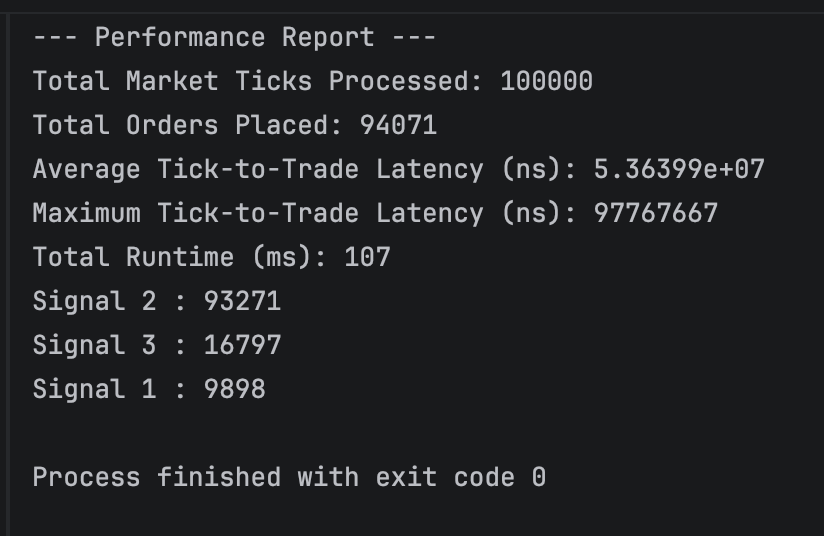

Contents
--------
This submission includes:
- Complete C++ source code
- Console output (attached as .txt file or screenshot)
- Short write-up (see below)


Sample Output
-------------


Write-up
--------

**1. Which signal triggered the most orders?**
   Signal 2.


**2. What could you optimize further?** 
   1. Current Signal2 logic calculates average of historical price everytime new event comes in.
   ```cpp
       double avg = getAvg(tick.instrument_id);
   ```
   This has runtime complexity of O(W). where W is the window size.

   Instead, we can keep rolling sum for each instrument and calculates average with O(1).

   2. Historical price lookup happens for each of the signal. We can lookup corresponding historical prices for event instrument and pass it around to different signals using reference instead.


**3. How would your code behave with 10x more data?** 

   The current implementation would scale linearly in runtime, but latency may increase due to cache misses and map lookups. For larger datasets, switching to more efficient data structures and parallelizing parts of the pipeline would be beneficial.

