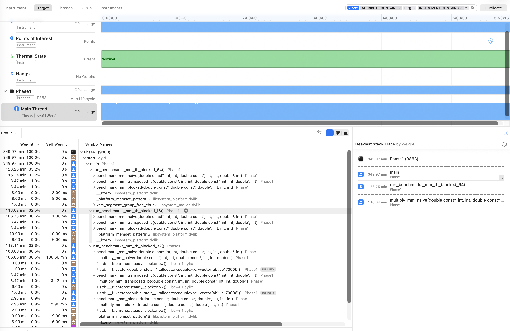

# High-Performance Linear Algebra Kernel

## Overview 

This project is to implement and optimize linear algebra operations(matrix-vector multiplication) considering cache locality, memory alignment, and the impact of compiler optimizations.

## Team Member

1. Mohammed Rhazi 12506615
2. Jae Won (Jay) Choi 12506596

## Build Instructions
- 

## Part3. Discussion Questions

### 1. Key differences between Reference and Pointers
- Reference is the alias of the variable whereas pointer is address that can be handled manually.
- Reference cannot be NULL, and does not require dereferencing, whereas pointer can be NULL and requires dereferencing.
- Memory access control can be only done via pointers (layout, traversal, arithmetic). 
- Pointer is preferred to traverse matrix or flexibly "striding" between elements within the containers whereas reference is preferred when passing the operands into mathematical functions or operating in single element.

### 2. Row-major vs Column-major and Cache Locality on matrix-vector and matrix-matrix
- Matrix-Vector
  - As C++ usually stores the matrix in row-major, where the adjacent elements are contiguous in the heap memory, Row-major computation is expected to be faster. 
  - However, in this assignment's setting, we assume column-major matrix is accessing elements that are also contiguous in heap memory, and therefore there is no expected difference in overall running time.
- Matrix-Matrix
  
  - For naive approach, matrix multiplication loops from left to right on the row of the left matrix and top to bottom on the column of the right matrix. Here, we need to "jump" from one index to another when we are looping from top to bottom on the second matrix.
  - To deal with this, we transpose the matrix before passing it into the function to keep the cache locality by making jumpy stride of the access of the element in a more contiguous manner which improves the runtime.
  
### 3. CPU Caches(L1, L2, L3) and temporal/spatial locality
- | Cache   | Size       | Speed       | Scope               |
  | ------- | ---------- | ----------- | ------------------- |
  | **L1**  | ~32KB      | fastest   | per core            |
  | **L2**  | ~256KB–1MB | fast        | per core            |
  | **L3**  | ~10–30MB   | slower      | shared across cores |
  | **RAM** | GBs        | very slow | global              |

  - Cache Lines
  Memory is not fetched one at a time. CPU loads cache lines (~64 bytes)
  - **Temporal locality**
  
    If the data is accessed once, the data is likely to be accessed again soon.

    - **Spatial locality** 
  
      If the data is accessed in one memory location, nearby locations will be used soon.
    - **How we exploited locality of memory**
   
      - Temporal Locality
      ```cpp
          result[i] += matrix[...] * vector[j];
      ```
      - Spatial Locality
      ```cpp
          sum += matrix[i*cols + j] * vector[j];
      ```
### 4. Memory Alignment

### 5. Compiler Optimization
- Compiler Optimization transforms my code to run faster without changing any behaviour.
- Inlining

  - Removes function call overhead 
  - Enables further optimization (vectorization)
- Loop optimizations

  - Unrolling, Reordering
- Auto-vectorization
- Impact on our performance optimization

  - The optimized implementation, especially via -O3, benefited more from higher optimization levels because it was written in a compiler-friendly way—contiguous memory access, simple loops, and no aliasing ambiguity.

- Potential Drawback of Aggressive Optimization 

  - It might hurt instruction cache (higher instruction cache pressure), chage floating-pointer behavior.


### 6. Profiling


- We have focused on optimizing Matrix * Matrix multiplication. We have provided the runtime of naive algorithm vs transposed algorithm vs block cached algorithm.
- We have tested for 3 different block sizes - 16, 32, and 64. 
- Due to updated cache locality in transposed version and blocked version, we could find significant improvement in the runtime of the algorithm from naive to optimized (110mins → 3mins 50s).
- As expected, the main bottleneck is the big stride between the index of memory for naive approach, whereas transposed version and block cached version leverages on cache locality and cache reuse which enables 30x faster result.
```cpp
  // bottleneck - naive approach
  result[i * colsB + j] += matrixA[i * colsA + k] * matrixB[k * colsB + j];
```
```cpp
  // block-cached - improved with cache reuse by storing result of submatrix
  int imax = std::min(ii+BS, N);
  int kmax = std::min(kk+BS, N);
  int jmax = std::min(jj+BS, N);
  
  for (int i=ii; i<imax; ++i) {
      for (int k=kk; k<kmax; ++k) {
          double aik = matrixA[i*N+k];
          for (int j=jj; j<jmax; ++j) {
              matrixC[i*N+j] += aik * matrixB[j*N+k];
```
- See more details about the implementation logic and result in report.md


### 7. Teamwork Assessment
- Mo implemented Matrix-Vector Multiplication and Jay implemented Matrix-Matrix Multiplication.
- We then explained his own logic on the implementation to each other, and then discussed about the potential points to be improved after running benchmarking tools and profiling.
- Challenges were that explaining the logic of each other's code and understanding the potential optimization area for the code (as our initial version of the codes were already pretty optimized).
- Benefit was that I need to be 100 percent sure about the logic of the code to explain about it and had a good opportunity to talk about the potential improvements in each other's code.
    
    
    