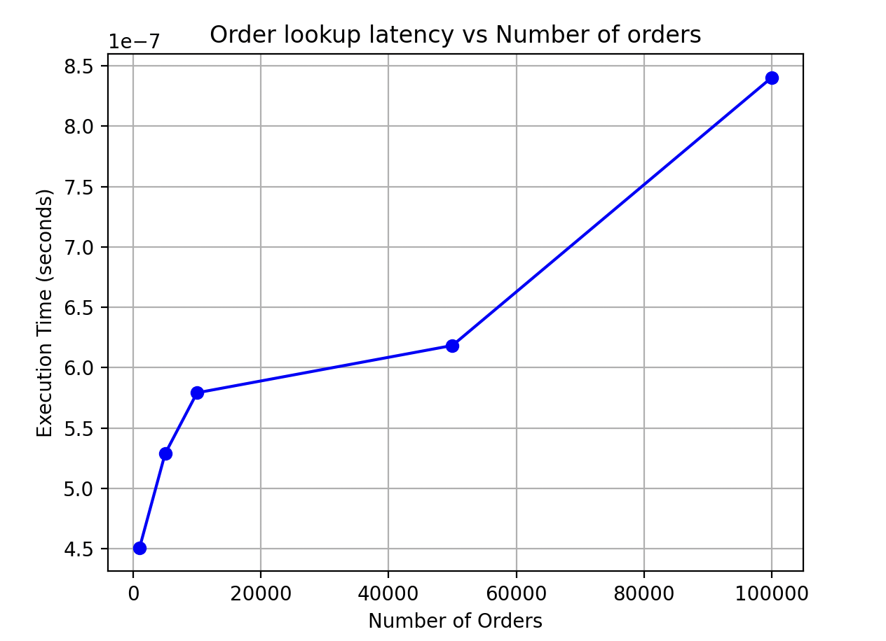
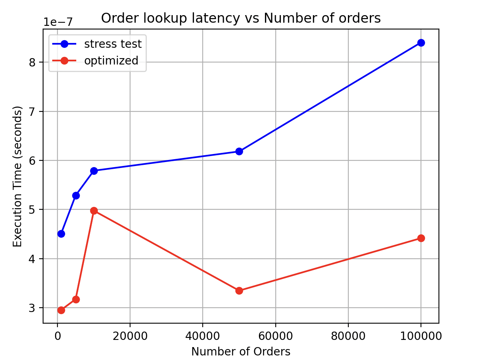
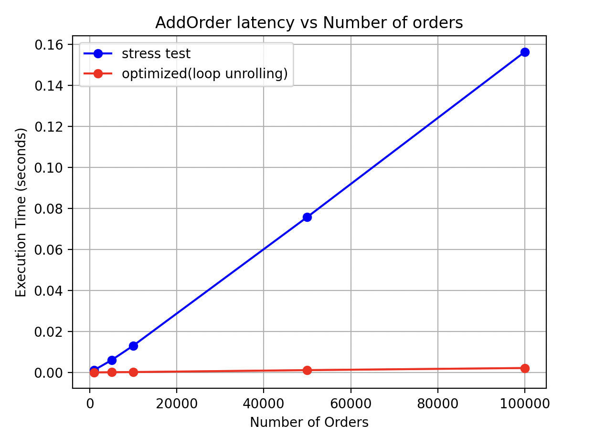
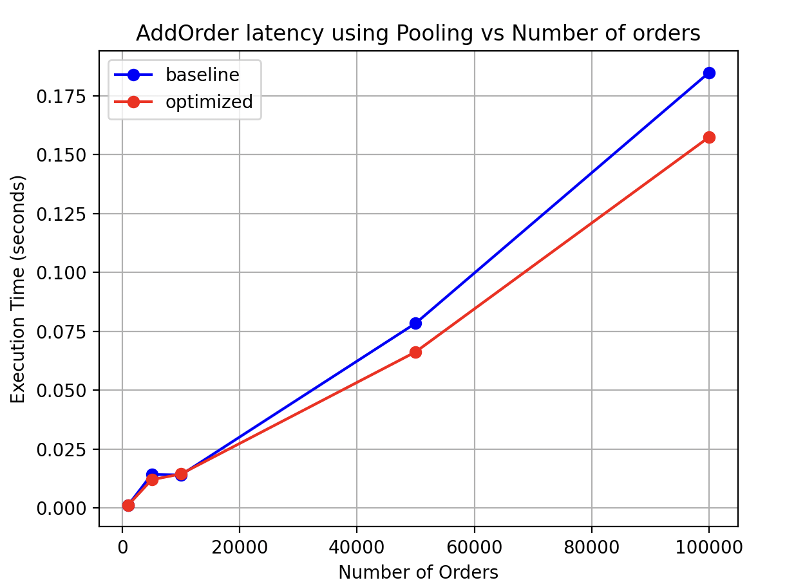

## Report

### Bottleneck analysis:
1.Lookup performance \
Lookups are expected to be quick: orders are stored in an unordered map which allows O(1) average lookup.
But performance can worsen if IDs collide. \
Solution: hashmaps can be sized using reserve() and/or use custom hash function.

```text
orderLookup.reserve(ticks)
```
```text
latencies.reserve(ticks)
```

2.Memory usage \
Each order is stored twice. so average search speed goes up but memory usage as well. one idea would be to 
store Order once and use pointers to Order in the other container. In HFT systems, memory pools are used to reduce 
fragmentation and allocation overhead

3.Branching delays \
Operations such as Add, Modify and Delete contain checks like if an order exists. These are used for correctness, 
but frequent branches may hurt performance. In practice separating valid/invalid order handling can improve branch prediction

### Execution time chart



The benchmark measures lookup latency after populating the book with stressTest(). The results are under 1 microsecond which is
consistent with the average unordered map lookup of O(1).

### Performance analysis report

#### Execution time comparison
This is a comparison of lookup latency after filling out the orderBooks:


From the figure, both implementations achieve sub microsecond latency in OrderLookup, which is consistent with the average unordered map O(1) lookup.
But the optimized version outperforms the baseline version (stress test).

The following figure is a comparison of AddOrder latency between the baseline method and the optimized (unroll) method (no pool copy):



Next we include pool copy in both paths:


#### Optimization effectiveness
Although optimized version achieves 30-50% latency reduction for Lookup. 
Since both implementations use the same unordered map Orderlookup, lookup is expected to be somewhat similar.
The observed differences are due to cache warm-up, allocator behaviour and noise rather than improvement in lookup.


up to 90% latency reduction in observed runs regarding AddOrder using unrolling: mainly due to reducing loop control overhead and improving instruction level parallelism.
however this should be interpreted with caution: this can also reflect differences in execution conditions

Finally introducing pooling does not provide measurable benefits in this setup. This suggests that dynamic allocation is not the principal bottleneck in this context. the allocator and data structures already handle allocations efficiently and cache locality is efficient in this context. 

Overall performance gains are noticeable after 50000 orders where memory and cache behavior are significant.

#### Latency breakdown & observations
Baseline (blue curve):
- latency increases with the number of orders
- slight non linearity due to cache misses and hash table resizing

Optimized (red curve):
- lower and more stable latency across scales 
- better cache utilization and few dynamic allocations

#### irregularities (spikes):
- due to CPU cache effects
- os schedling noise
- hash table rehashing


### Conclusion
We conclude that optimizing CPU execution patterns (loop structure) can bring more immediate gains than memory pooling when allocation is not the main bottleneck.


### units tests
Units tests are implemented using `assert()`.

Test cases include: \
-add an order and check it exists\
-delete an order and check it's removed\
-modify an order and check if price and quantity are updated

```text
testAddOrder();
testDeleteOrder();
testModifyOrder();
```

### Stress testing
Stress tests were performed by generating randomized orders, and inserted into the order book to evaluate stability under load:
```text
std::vector<Order> orders = generateOrders(100000);

for (const auto& order : orders) {
    orderBook.addOrder(order.id, order.price, order.quantity, order.isBuy);
}
```
no crashes or invalid add orders are observed in stress testing. This confirms the order book is stable under large randomized workloads
